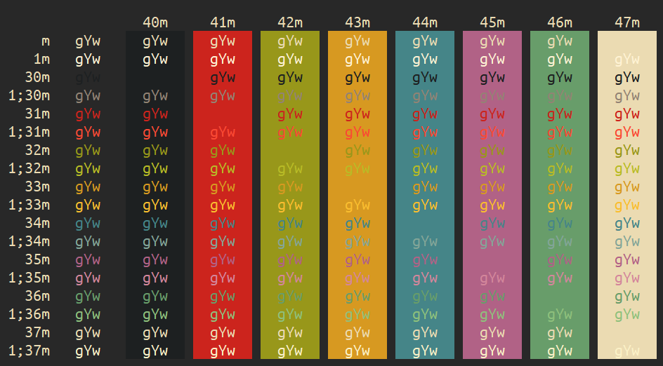

# gruvbox-mintty

Gruvbox theme for mintty / wsltty

#### Installation

Merge `gruvbox` into your `.minttyrc`

*or*

Place `gruvbox` in `%appdata%\{mintty | wsltty}\themes` and select it in Options > Looks

---------------------------
License: [MIT](LICENSE)
